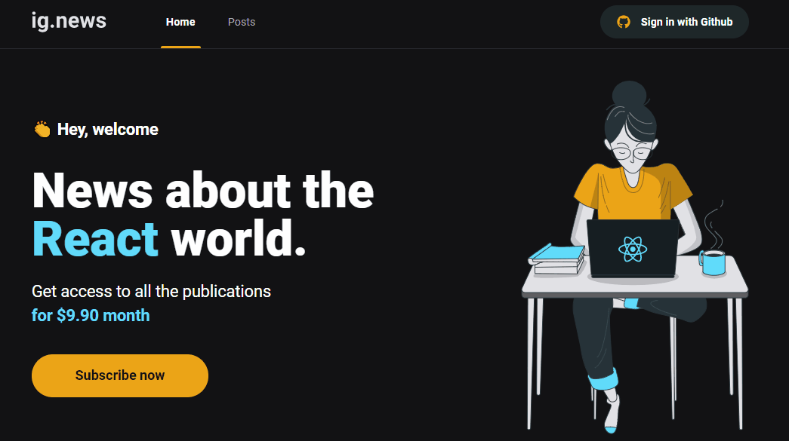

<h1 align="center">
    
</h1>

<h1 align="center">
    
</h1>

# 💻 Sobre o projeto
Site de notícias para programadores interessados em React, utilizando Next.js, Stripe, FaunaDB e login com Github.

Projeto desenvolvido durante o 🚀 **Bootcamp Ignite** 🚀 - Oferecida pela **Rocketseat**

---

## 🚨 Como baixar o projeto
Antes de começar, você vai precisar ter instalado em sua máquina as seguintes ferramentas: Git, Node.js. Além disto ter um editor para trabalhar com o código como VSCode

### 🏁 Para rodar a aplicação 

```bash

    # Clonar o repositório
    $ git clone https://github.com/milealmeida/ignite-ignews

    # Entrar no diretório
    $ cd {nomepasta}

    # Instalar as dependências
    $ yarn install

    # Iniciar o projeto no terminal
    $ yarn dev

```

---
Desenvolvido por Milena Almeida 💙